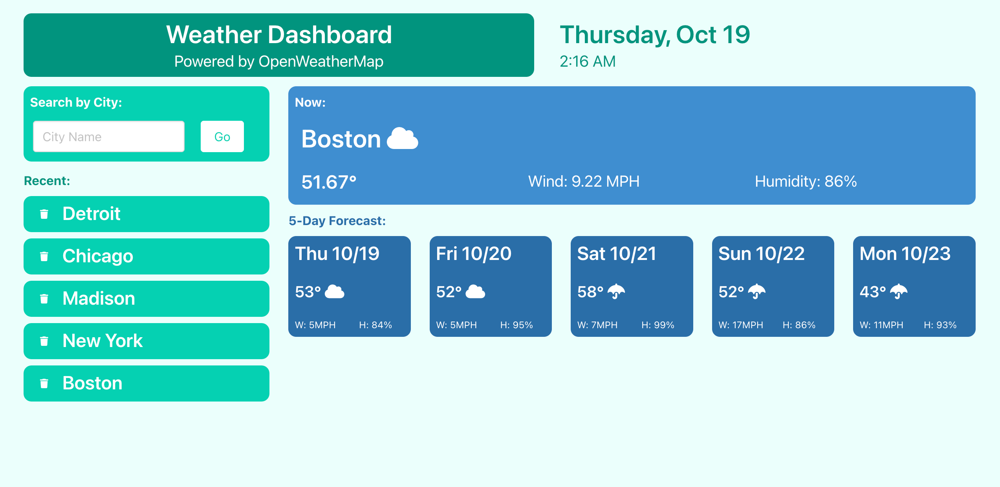

# Simple Weather App

## Description

Simple Weather App is a basic weather application using the OpenWeatherMap API.

- I was motivated to build a weather app to make a quick and easy way to check the weather & hone my skills integrating APIs into my projects.
- I learned a significant amount about pulling data from an API and then utilizing that data within a project. I've also gotten more practice with things like localStorage, DOM traversal, and appending HTML elements.

## Usage
### [Got rain? Check the weather!](https://abealberts.github.io/weather-app/)
#### Features:

- Current weather & 5-day forecast
- Displays information about temp, wind, humidity, and weather type
- Search the weather by any City
- Auto saving for recent locations
- Delete unwanted saved locations

#### Screenshot:

